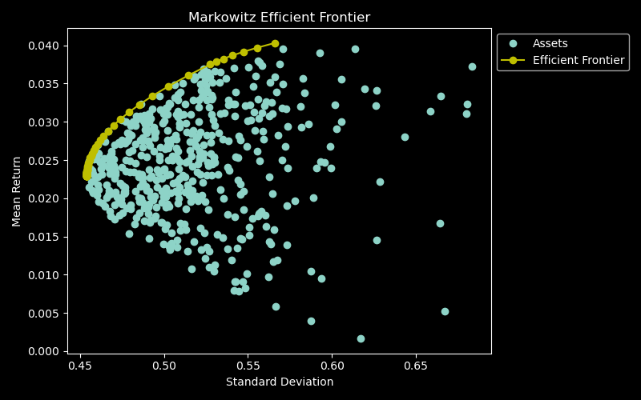

<h1 align="center">

</h1>

[](https://pypi.org/project/quantspace/)
[](https://github.com/quantspaceai/quantspace/blob/master/LICENSE)

**quantspace** is a Python library designed specifically for quantitative finance, with a primary focus on supporting research and education in the field. 

- Risk Management
- Portfolio Optimization
- Anomaly Detection

## Features

### 1. **Quantitative Research Tools**

**quantspace** offers a comprehensive set of tools for conducting quantitative research in finance. From statistical analysis to advanced modeling techniques, the library provides the building blocks for developing and testing sophisticated financial strategies.

### 2. **Educational Resources**

Designed with education in mind, **quantspace** includes resources and examples to help users understand and apply quantitative finance concepts. The library serves as a valuable resource for students, providing hands-on experience with real-world financial data and models.

### 3. **Data Integration**

**quantspace** seamlessly integrates with popular financial data sources, allowing users to access and analyze real-time and historical market data. This feature enhances the library's capabilities for both research and educational purposes.

### 4. **Flexibility and Customization**

The library is designed to be flexible and customizable, accommodating a wide range of financial modeling requirements. Whether you are developing algorithms for risk management, portfolio optimization, or derivative pricing, **quantspace** provides a robust foundation for implementation.

## Getting Started

To get started with **quantspace**, follow these simple steps:

1. **Installation:**
   ```
   pip install quantspace
   ```

2. **Getting Started:**

- **Risk measure:**
   ```python
   from quantspace.risk import summary_risk

   returns = [0.065, 0.0265, -0.0593, -0.001, 0.0346]
   summary_risk(returns=returns, risk_free_rate=0.05)
   ```

- **Portfolio optimization:**
   ```python
   from quantspace.utils.datasets import random_portfolio
   from quantspace.portfolio import MarkowitzFrontier

   import numpy as np
   np.random.seed(1234)

   n_assets = 5 # number of assets in portfolio
   n_obs = 1000 # number of observations in data
   return_vec = np.random.randn(n_assets, n_obs) # generate random returns for each asset

   n_portfolios = 500 # number of portfolios to simulate
   means, stds = np.column_stack([
      random_portfolio(return_vec) 
      for _ in range(n_portfolios)
   ])

   # instantiate MarkowitzFrontier class
   m_frontier = MarkowitzFrontier(return_vec, stds, means)

   # plot efficient frontier
   m_frontier.plot_frontier()
   ```
   


## Contributions

We welcome contributions from the community to enhance and expand **quantspace**. If you have ideas for new features, improvements, or find any issues, please feel free to contribute by submitting a pull request or opening an issue on our GitHub repository.

## Support and Community

For support or to connect with other users and contributors, join our community forums. We encourage discussions, knowledge sharing, and collaboration within the **quantspace** community.

## License

**quantspace** is released under the [MIT License](LICENSE), making it open and accessible for a wide range of users.

## Disclaimer

**quantspace** is provided "as is" without any warranty, express or implied. Use it at your own risk, and carefully review and test any code before deploying it in a production environment.

Happy quantifying with **quantspace**!